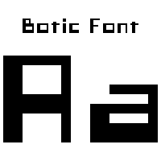

# Font Botic for Minetest Font API mod

This mod adds Botic font to Font API mod (from [display_modpack](https://github.com/pyrollo/display_modpack)).

For more information, see the [forum topic](https://forum.minetest.net/viewtopic.php?t=13563) at the Minetest forums.

**Dependancies**: font_api

**License**: code under LGPL v2.1, font under OFL v1.1

## Original Font

**Original font**: Botic by Pixeldroid

**License**: SIL OPEN FONT LICENSE Version 1.1

[Browse GitHub repository](https://github.com/pixeldroid/fonts)
